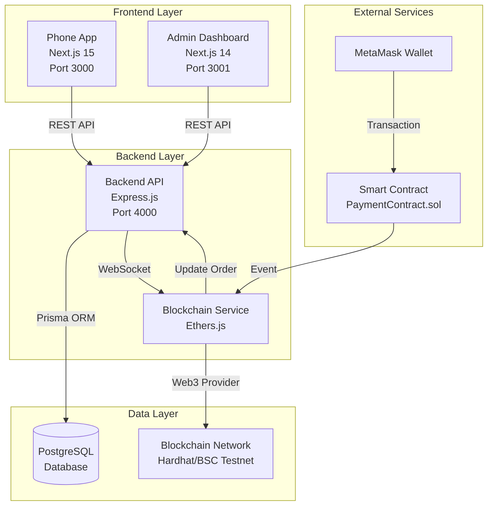

# 📱 E-Commerce Phone Store - Tài Liệu Tổng Quan Dự Án

> **Phiên bản**: 2.0.0 | **Cập nhật**: December 2024  
> **Ngôn ngữ**: Tiếng Việt | **Môi trường**: Development & Production

---

## 📑 Mục Lục

1. [Giới Thiệu Dự Án](#1-giới-thiệu-dự-án)
2. [Kiến Trúc Hệ Thống](#2-kiến-trúc-hệ-thống)
3. [Tech Stack](#3-tech-stack)
4. [Cấu Trúc Thư Mục](#4-cấu-trúc-thư-mục)
5. [Các Tính Năng Chính](#5-các-tính-năng-chính)
6. [Luồng Hoạt Động](#6-luồng-hoạt-động)
7. [API Endpoints](#7-api-endpoints)
8. [Database Schema](#8-database-schema)
9. [Blockchain Integration](#9-blockchain-integration)
10. [Thuật Ngữ và Khái Niệm](#10-thuật-ngữ-và-khái-niệm)
11. [Hướng Dẫn Triển Khai](#11-hướng-dẫn-triển-khai)
12. [Troubleshooting](#12-troubleshooting)

---

## 1. Giới Thiệu Dự Án

### 1.1 Tổng Quan

**E-Commerce Phone Store** là một hệ thống thương mại điện tử hoàn chỉnh chuyên bán các sản phẩm Apple (iPhone, iPad, MacBook, Apple Watch, phụ kiện) với tích hợp thanh toán blockchain.

### 1.2 Mục Tiêu

- ✅ Cung cấp trải nghiệm mua sắm trực tuyến mượt mà cho khách hàng
- ✅ Quản lý sản phẩm, đơn hàng, khách hàng hiệu quả cho admin
- ✅ Hỗ trợ đa phương thức thanh toán (COD, chuyển khoản, blockchain)
- ✅ Tích hợp blockchain payment với MetaMask
- ✅ Responsive design cho mọi thiết bị

### 1.3 Đặc Điểm Nổi Bật

- **Monorepo Architecture**: Quản lý tập trung backend, frontend, blockchain
- **Real-time Updates**: WebSocket cho cập nhật đơn hàng real-time
- **Blockchain Payment**: Thanh toán bằng cryptocurrency (ETH, USDT, USDC)
- **Advanced Admin Dashboard**: Quản lý toàn diện với analytics và charts
- **Hierarchical Categories**: Phân loại sản phẩm linh hoạt nhiều cấp
- **JWT Authentication**: Bảo mật với access token + refresh token

---

## 2. Kiến Trúc Hệ Thống

### 2.1 Sơ Đồ Tổng Quan

### 2.2 Các Thành Phần Chính

#### 2.2.1 Backend API (Express.js)
- **Vai trò**: Xử lý business logic, authentication, database operations
- **Port**: 4000
- **Công nghệ**: Express.js + TypeScript + Prisma ORM
- **Chức năng**:
  - RESTful API endpoints
  - JWT authentication với refresh token
  - Role-based access control (RBAC)
  - File upload (product images)
  - WebSocket cho real-time updates
  - Blockchain event listener

#### 2.2.2 Phone App (Customer Frontend)
- **Vai trò**: Giao diện mua sắm cho khách hàng
- **Port**: 3000
- **Công nghệ**: Next.js 15 + TypeScript + Tailwind CSS
- **Chức năng**:
  - Xem danh sách sản phẩm, chi tiết sản phẩm
  - Giỏ hàng (hỗ trợ cả user đã đăng nhập và anonymous)
  - Đặt hàng với nhiều phương thức thanh toán
  - Thanh toán blockchain qua MetaMask
  - Quản lý tài khoản, lịch sử đơn hàng
  - Responsive design

#### 2.2.3 Admin Dashboard
- **Vai trò**: Quản lý hệ thống cho admin
- **Port**: 3001
- **Công nghệ**: Next.js 14 + shadcn/ui + React Query
- **Chức năng**:
  - Dashboard analytics với charts
  - Quản lý sản phẩm (CRUD)
  - Quản lý danh mục (hierarchical)
  - Quản lý đơn hàng (tracking, update status)
  - Quản lý khách hàng
  - Quản lý người dùng và phân quyền
  - Xóa đơn hàng (mới thêm)

#### 2.2.4 Blockchain Service
- **Vai trò**: Xử lý thanh toán cryptocurrency
- **Công nghệ**: Ethers.js + Hardhat
- **Chức năng**:
  - Lắng nghe events từ smart contract
  - Verify blockchain transactions
  - Cập nhật trạng thái thanh toán
  - Hỗ trợ ETH, USDT, USDC

#### 2.2.5 Database (PostgreSQL)
- **Vai trò**: Lưu trữ dữ liệu
- **ORM**: Prisma
- **Chức năng**:
  - User management
  - Product catalog
  - Order management
  - Cart management
  - Session management

---

## 3. Tech Stack

### 3.1 Backend

| Công Nghệ | Phiên Bản | Mục Đích |
|-----------|-----------|----------|
| Node.js | 20+ | Runtime environment |
| TypeScript | 5.x | Type safety |
| Express.js | 4.x | Web framework |
| Prisma | 6.x | ORM |
| PostgreSQL | 12+ | Database |
| JWT | - | Authentication |
| Zod | - | Validation |
| Bcrypt | - | Password hashing |
| Multer | - | File upload |
| Ethers.js | 5.x | Blockchain integration |
| Helmet | - | Security headers |
| CORS | - | Cross-origin requests |

### 3.2 Frontend (Phone App)

| Công Nghệ | Phiên Bản | Mục Đích |
|-----------|-----------|----------|
| Next.js | 15 | React framework |
| TypeScript | 5.x | Type safety |
| Tailwind CSS | 4.x | Styling |
| Radix UI | - | Headless components |
| shadcn/ui | - | UI components |
| React Hook Form | - | Form management |
| Zod | - | Validation |
| Lucide React | - | Icons |
| next-themes | - | Dark/light mode |

### 3.3 Frontend (Admin Dashboard)

| Công Nghệ | Phiên Bản | Mục Đích |
|-----------|-----------|----------|
| Next.js | 14 | React framework |
| TypeScript | 5.x | Type safety |
| Tailwind CSS | 3.x | Styling |
| shadcn/ui | - | UI components |
| React Query | 5.x | Server state management |
| Zustand | 4.x | Client state management |
| Axios | - | HTTP client |
| Recharts | 2.x | Data visualization |
| Sonner | - | Toast notifications |
| React Hook Form | - | Form management |

### 3.4 Blockchain

| Công Nghệ | Phiên Bản | Mục Đích |
|-----------|-----------|----------|
| Hardhat | - | Development environment |
| Solidity | 0.8.19 | Smart contract language |
| Ethers.js | 5.x | Web3 library |
| OpenZeppelin | - | Smart contract library |
| MetaMask | - | Wallet integration |

