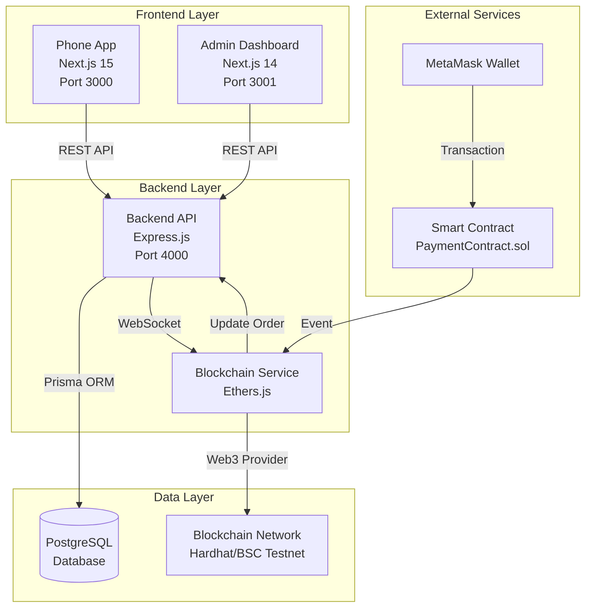

# 📱 E-Commerce Phone Store - Tài Liệu Tổng Quan Dự Án

> **Phiên bản**: 2.0.0 | **Cập nhật**: December 2024  
> **Ngôn ngữ**: Tiếng Việt | **Môi trường**: Development & Production

---

## 📑 Mục Lục

1. [Giới Thiệu Dự Án](#1-giới-thiệu-dự-án)
2. [Kiến Trúc Hệ Thống](#2-kiến-trúc-hệ-thống)
3. [Tech Stack](#3-tech-stack)
4. [Cấu Trúc Thư Mục](#4-cấu-trúc-thư-mục)
5. [Các Tính Năng Chính](#5-các-tính-năng-chính)
6. [Luồng Hoạt Động](#6-luồng-hoạt-động)
7. [API Endpoints](#7-api-endpoints)
8. [Database Schema](#8-database-schema)
9. [Blockchain Integration](#9-blockchain-integration)
10. [Thuật Ngữ và Khái Niệm](#10-thuật-ngữ-và-khái-niệm)
11. [Hướng Dẫn Triển Khai](#11-hướng-dẫn-triển-khai)
12. [Troubleshooting](#12-troubleshooting)

---

## 1. Giới Thiệu Dự Án

### 1.1 Tổng Quan

**E-Commerce Phone Store** là một hệ thống thương mại điện tử hoàn chỉnh chuyên bán các sản phẩm Apple (iPhone, iPad, MacBook, Apple Watch, phụ kiện) với tích hợp thanh toán blockchain.

### 1.2 Mục Tiêu

- ✅ Cung cấp trải nghiệm mua sắm trực tuyến mượt mà cho khách hàng
- ✅ Quản lý sản phẩm, đơn hàng, khách hàng hiệu quả cho admin
- ✅ Hỗ trợ đa phương thức thanh toán (COD, chuyển khoản, blockchain)
- ✅ Tích hợp blockchain payment với MetaMask
- ✅ Responsive design cho mọi thiết bị

### 1.3 Đặc Điểm Nổi Bật

- **Monorepo Architecture**: Quản lý tập trung backend, frontend, blockchain
- **Real-time Updates**: WebSocket cho cập nhật đơn hàng real-time
- **Blockchain Payment**: Thanh toán bằng cryptocurrency (ETH, USDT, USDC)
- **Advanced Admin Dashboard**: Quản lý toàn diện với analytics và charts
- **Hierarchical Categories**: Phân loại sản phẩm linh hoạt nhiều cấp
- **JWT Authentication**: Bảo mật với access token + refresh token

---

## 2. Kiến Trúc Hệ Thống

### 2.1 Sơ Đồ Tổng Quan



### 2.2 Các Thành Phần Chính

#### 2.2.1 Backend API (Express.js)
- **Vai trò**: Xử lý business logic, authentication, database operations
- **Port**: 4000
- **Công nghệ**: Express.js + TypeScript + Prisma ORM
- **Chức năng**:
  - RESTful API endpoints
  - JWT authentication với refresh token
  - Role-based access control (RBAC)
  - File upload (product images)
  - WebSocket cho real-time updates
  - Blockchain event listener

#### 2.2.2 Phone App (Customer Frontend)
- **Vai trò**: Giao diện mua sắm cho khách hàng
- **Port**: 3000
- **Công nghệ**: Next.js 15 + TypeScript + Tailwind CSS
- **Chức năng**:
  - Xem danh sách sản phẩm, chi tiết sản phẩm
  - Giỏ hàng (hỗ trợ cả user đã đăng nhập và anonymous)
  - Đặt hàng với nhiều phương thức thanh toán
  - Thanh toán blockchain qua MetaMask
  - Quản lý tài khoản, lịch sử đơn hàng
  - Responsive design

#### 2.2.3 Admin Dashboard
- **Vai trò**: Quản lý hệ thống cho admin
- **Port**: 3001
- **Công nghệ**: Next.js 14 + shadcn/ui + React Query
- **Chức năng**:
  - Dashboard analytics với charts
  - Quản lý sản phẩm (CRUD)
  - Quản lý danh mục (hierarchical)
  - Quản lý đơn hàng (tracking, update status)
  - Quản lý khách hàng
  - Quản lý người dùng và phân quyền
  - Xóa đơn hàng (mới thêm)

#### 2.2.4 Blockchain Service
- **Vai trò**: Xử lý thanh toán cryptocurrency
- **Công nghệ**: Ethers.js + Hardhat
- **Chức năng**:
  - Lắng nghe events từ smart contract
  - Verify blockchain transactions
  - Cập nhật trạng thái thanh toán
  - Hỗ trợ ETH, USDT, USDC

#### 2.2.5 Database (PostgreSQL)
- **Vai trò**: Lưu trữ dữ liệu
- **ORM**: Prisma
- **Chức năng**:
  - User management
  - Product catalog
  - Order management
  - Cart management
  - Session management

---

## 3. Tech Stack

### 3.1 Backend

| Công Nghệ | Phiên Bản | Mục Đích |
|-----------|-----------|----------|
| Node.js | 20+ | Runtime environment |
| TypeScript | 5.x | Type safety |
| Express.js | 4.x | Web framework |
| Prisma | 6.x | ORM |
| PostgreSQL | 12+ | Database |
| JWT | - | Authentication |
| Zod | - | Validation |
| Bcrypt | - | Password hashing |
| Multer | - | File upload |
| Ethers.js | 5.x | Blockchain integration |
| Helmet | - | Security headers |
| CORS | - | Cross-origin requests |

### 3.2 Frontend (Phone App)

| Công Nghệ | Phiên Bản | Mục Đích |
|-----------|-----------|----------|
| Next.js | 15 | React framework |
| TypeScript | 5.x | Type safety |
| Tailwind CSS | 4.x | Styling |
| Radix UI | - | Headless components |
| shadcn/ui | - | UI components |
| React Hook Form | - | Form management |
| Zod | - | Validation |
| Lucide React | - | Icons |
| next-themes | - | Dark/light mode |

### 3.3 Frontend (Admin Dashboard)

| Công Nghệ | Phiên Bản | Mục Đích |
|-----------|-----------|----------|
| Next.js | 14 | React framework |
| TypeScript | 5.x | Type safety |
| Tailwind CSS | 3.x | Styling |
| shadcn/ui | - | UI components |
| React Query | 5.x | Server state management |
| Zustand | 4.x | Client state management |
| Axios | - | HTTP client |
| Recharts | 2.x | Data visualization |
| Sonner | - | Toast notifications |
| React Hook Form | - | Form management |

### 3.4 Blockchain

| Công Nghệ | Phiên Bản | Mục Đích |
|-----------|-----------|----------|
| Hardhat | - | Development environment |
| Solidity | 0.8.19 | Smart contract language |
| Ethers.js | 5.x | Web3 library |
| OpenZeppelin | - | Smart contract library |
| MetaMask | - | Wallet integration |

---

## 4. Cấu Trúc Thư Mục

### 4.1 Tổng Quan Monorepo

```
newpro/
├── backend/              # Backend API (Express.js)
├── phone-app/            # Customer frontend (Next.js 15)
├── admin-dashboard/      # Admin frontend (Next.js 14)
├── blockchain/           # Smart contracts (Hardhat)
├── README.md             # Tài liệu chính
└── PROJECT_OVERVIEW.md   # Tài liệu này
```

### 4.2 Backend Structure

```
backend/
├── src/
│   ├── app.ts                    # Express app configuration
│   ├── index.ts                  # Server entry point
│   ├── controllers/              # Request handlers
│   │   ├── auth.controller.ts    # Authentication
│   │   ├── product.controller.ts # Product management
│   │   ├── order.controller.ts   # Order management
│   │   ├── cart.controller.ts    # Shopping cart
│   │   └── ...
│   ├── services/                 # Business logic
│   │   ├── auth.service.ts
│   │   ├── order.service.ts
│   │   ├── blockchain/
│   │   │   └── blockchain.service.ts  # Blockchain integration
│   │   └── ...
│   ├── routes/                   # API routes
│   │   ├── auth.route.ts         # /api/auth/*
│   │   ├── product.route.ts      # /api/products/*
│   │   ├── order.route.ts        # /api/orders/*
│   │   ├── blockchain.route.ts   # /api/blockchain/*
│   │   └── ...
│   ├── middlewares/              # Express middlewares
│   │   ├── auth.ts               # JWT authentication
│   │   ├── validate.ts           # Zod validation
│   │   └── error.ts              # Error handling
│   ├── schemas/                  # Zod validation schemas
│   │   ├── auth.schema.ts
│   │   ├── product.schema.ts
│   │   └── ...
│   └── utils/                    # Utilities
│       ├── jwt.ts                # JWT helpers
│       ├── prisma.ts             # Prisma client
│       └── ...
├── prisma/
│   ├── schema.prisma             # Database schema
│   ├── migrations/               # Database migrations
│   └── seed.ts                   # Seed data
├── scripts/
│   ├── create-admin.ts           # Create admin user
│   └── fix-admin-role.ts         # Fix admin role
├── public/pictures/              # Product images
├── uploads/                      # User uploads
├── package.json
├── tsconfig.json
└── docker-compose.yml            # PostgreSQL container
```

**Giải thích**:
- **controllers/**: Xử lý HTTP requests, validate input, gọi services
- **services/**: Business logic, database operations
- **routes/**: Định nghĩa API endpoints và middlewares
- **middlewares/**: Authentication, validation, error handling
- **schemas/**: Zod schemas cho validation
- **prisma/**: Database schema và migrations

### 4.3 Phone App Structure

```
phone-app/
├── src/
│   ├── app/                      # Next.js App Router
│   │   ├── layout.tsx            # Root layout
│   │   ├── page.tsx              # Home page
│   │   ├── (auth)/               # Auth group
│   │   │   ├── login/
│   │   │   └── register/
│   │   ├── account/              # Account pages
│   │   │   ├── profile/
│   │   │   └── orders/
│   │   ├── product/              # Product pages
│   │   │   └── [slug]/
│   │   ├── gio-hang/             # Cart page
│   │   ├── thanh-toan/           # Checkout page
│   │   └── dat-hang-thanh-cong/  # Order success
│   ├── components/               # React components
│   │   ├── auth-provider.tsx     # Auth context
│   │   ├── header/               # Header components
│   │   ├── footer/               # Footer components
│   │   ├── product/              # Product components
│   │   ├── checkout/             # Checkout components
│   │   │   └── blockchain-payment-modal.tsx
│   │   └── ui/                   # shadcn/ui components
│   ├── lib/                      # Utilities
│   │   ├── api.ts                # API client
│   │   ├── auth-client.ts        # Auth utilities
│   │   ├── cart-api.ts           # Cart API
│   │   ├── order-api.ts          # Order API
│   │   ├── blockchain/           # Blockchain integration
│   │   │   ├── config.ts         # Contract config
│   │   │   ├── use-metamask.ts   # MetaMask hook
│   │   │   └── use-payment.ts    # Payment hook
│   │   └── token.ts              # Token management
│   ├── hooks/                    # Custom hooks
│   └── utils/                    # Helper functions
├── public/pictures/              # Static images
├── package.json
├── next.config.ts
└── tailwind.config.ts
```

**Giải thích**:
- **app/**: Next.js 15 App Router với file-based routing
- **components/**: Reusable React components
- **lib/**: API clients, utilities, blockchain integration
- **hooks/**: Custom React hooks
- **blockchain/**: MetaMask và payment integration

### 4.4 Admin Dashboard Structure

```
admin-dashboard/
├── src/
│   ├── app/
│   │   ├── layout.tsx            # Root layout
│   │   ├── providers.tsx         # React Query + Toast
│   │   ├── (auth)/               # Auth routes
│   │   │   └── login/
│   │   └── (dashboard)/          # Protected routes
│   │       ├── layout.tsx        # Dashboard layout
│   │       ├── page.tsx          # Dashboard home
│   │       ├── products/         # Product management
│   │       ├── orders/           # Order management
│   │       ├── customers/        # Customer management
│   │       ├── categories/       # Category management
│   │       └── users/            # User management
│   ├── components/
│   │   ├── layout/               # Sidebar, header
│   │   ├── dashboard/            # Dashboard widgets
│   │   │   ├── revenue-chart.tsx
│   │   │   ├── order-status-chart.tsx
│   │   │   └── ...
│   │   ├── products/             # Product components
│   │   └── ui/                   # shadcn/ui components
│   ├── hooks/                    # React Query hooks
│   │   ├── use-auth.ts
│   │   ├── use-products.ts
│   │   ├── use-orders.ts
│   │   ├── use-dashboard.ts
│   │   └── ...
│   ├── lib/
│   │   ├── api.ts                # Axios instance
│   │   └── auth.ts               # Auth utilities
│   ├── types/                    # TypeScript types
│   │   └── models.ts
│   └── store/                    # Zustand stores (if any)
├── package.json
├── tsconfig.json
└── tailwind.config.ts
```

**Giải thích**:
- **app/(dashboard)/**: Protected admin routes
- **components/dashboard/**: Charts và widgets
- **hooks/**: React Query hooks cho data fetching
- **lib/api.ts**: Axios với JWT interceptor

### 4.5 Blockchain Structure

```
blockchain/
├── contracts/
│   └── PaymentContract.sol       # Smart contract
├── scripts/
│   ├── deploy.ts                 # Deploy script
│   └── test-simple-payment.ts    # Test script
├── config/
│   └── deployed-contracts.json   # Deployed addresses
├── hardhat.config.ts             # Hardhat configuration
├── package.json
└── tsconfig.json
```

**Giải thích**:
- **contracts/**: Solidity smart contracts
- **scripts/**: Deployment và testing scripts
- **config/**: Contract addresses sau khi deploy

---

## 5. Các Tính Năng Chính

### 5.1 Authentication & Authorization

#### 5.1.1 JWT Authentication
- **Access Token**: Thời hạn 15 phút, lưu trong memory/localStorage
- **Refresh Token**: Thời hạn 30 ngày, lưu trong HTTP-only cookie
- **Auto Refresh**: Frontend tự động refresh access token khi hết hạn

#### 5.1.2 Role-Based Access Control (RBAC)
- **USER**: Khách hàng thường
  - Xem sản phẩm
  - Quản lý giỏ hàng
  - Đặt hàng
  - Xem lịch sử đơn hàng
- **ADMIN**: Quản trị viên
  - Tất cả quyền của USER
  - Quản lý sản phẩm (CRUD)
  - Quản lý đơn hàng (update status, xóa)
  - Quản lý khách hàng
  - Xem analytics và reports

#### 5.1.3 Password Reset
- Request reset qua email
- Token có thời hạn
- One-time use token

### 5.2 Product Management

#### 5.2.1 Hierarchical Categories
- **Cấu trúc**: Parent → Child → Grandchild
- **Ví dụ**: "Điện thoại" → "iPhone" → "iPhone 15 Series"
- **Tính năng**:
  - Tạo/sửa/xóa category
  - Drag & drop để sắp xếp
  - Active/Inactive status

#### 5.2.2 Product Features
- **Thông tin cơ bản**: Name, slug, description, price
- **Hình ảnh**: Main image + gallery (multiple images)
- **Variants**: Color, storage options
- **Specs**: RAM, storage, flexible JSON specs
- **Badges**: "Trả góp 0%", "Giảm sốc", etc.
- **Stock management**: Inventory tracking
- **Ratings & Reviews**: Rating score và review count

### 5.3 Shopping Cart

#### 5.3.1 Cart Types
- **Logged-in User**: Cart lưu trong database, đồng bộ across devices
- **Anonymous User**: Cart lưu trong sessionStorage, chuyển sang database khi login

#### 5.3.2 Cart Operations
- Add to cart
- Update quantity
- Remove item
- Clear cart
- Apply variants (color, storage)

### 5.4 Order Management

#### 5.4.1 Order Creation
- **Customer Info**: Name, email, phone
- **Shipping Address**: Address, city, district, ward
- **Payment Method**: COD, Bank Transfer, MoMo, VNPay, Blockchain
- **Order Items**: Products với variants

#### 5.4.2 Order Status Flow
```
PENDING → CONFIRMED → PROCESSING → SHIPPING → DELIVERED
                ↓
            CANCELLED
```

#### 5.4.3 Payment Status
- **PENDING**: Chưa thanh toán
- **COMPLETED**: Đã thanh toán
- **FAILED**: Thanh toán thất bại
- **REFUNDED**: Đã hoàn tiền

#### 5.4.4 Admin Operations
- Update order status
- Update payment status
- View order details
- Delete order (mới thêm)
- Export orders to Excel

### 5.5 Blockchain Payment

#### 5.5.1 Supported Tokens
- **ETH**: Native Ethereum/BNB
- **USDT**: Tether stablecoin
- **USDC**: USD Coin stablecoin

#### 5.5.2 Payment Flow
1. Customer chọn "Thanh toán Blockchain"
2. Nhập số lượng crypto
3. Kết nối MetaMask wallet
4. Approve token (nếu dùng ERC20)
5. Gửi transaction
6. Backend lắng nghe event từ smart contract
7. Verify transaction
8. Cập nhật order status

#### 5.5.3 Smart Contract Features
- **PaymentContract.sol**: Main payment contract
- **Events**: OrderPaid event khi thanh toán thành công
- **Security**: ReentrancyGuard, Ownable
- **Functions**:
  - `payOrderWithNative()`: Thanh toán bằng ETH/BNB
  - `payOrderWithToken()`: Thanh toán bằng ERC20
  - `isOrderProcessed()`: Kiểm tra order đã xử lý chưa

### 5.6 Admin Dashboard Analytics

#### 5.6.1 Dashboard Widgets
- **Revenue Chart**: Line chart hiển thị doanh thu theo thời gian
- **Order Status Chart**: Pie chart phân bố trạng thái đơn hàng
- **Top Products**: Best-selling products
- **Recent Orders**: Đơn hàng mới nhất

#### 5.6.2 Reports
- Revenue by period (7 days, 30 days, 12 months)
- Order statistics
- Customer analytics
- Product performance

---

