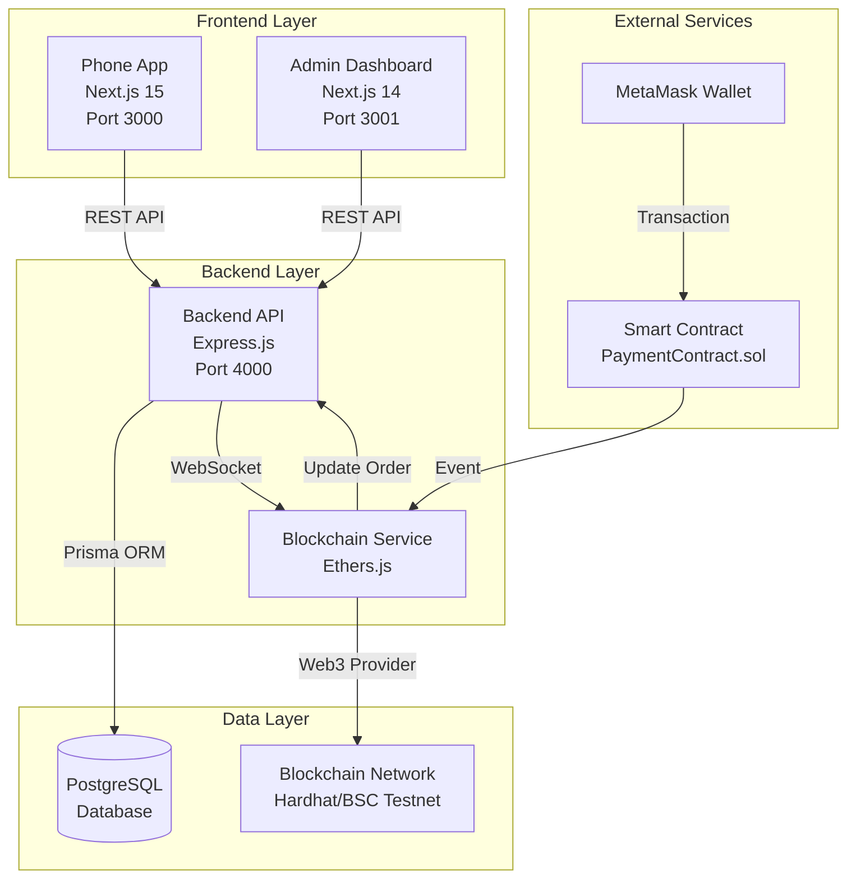
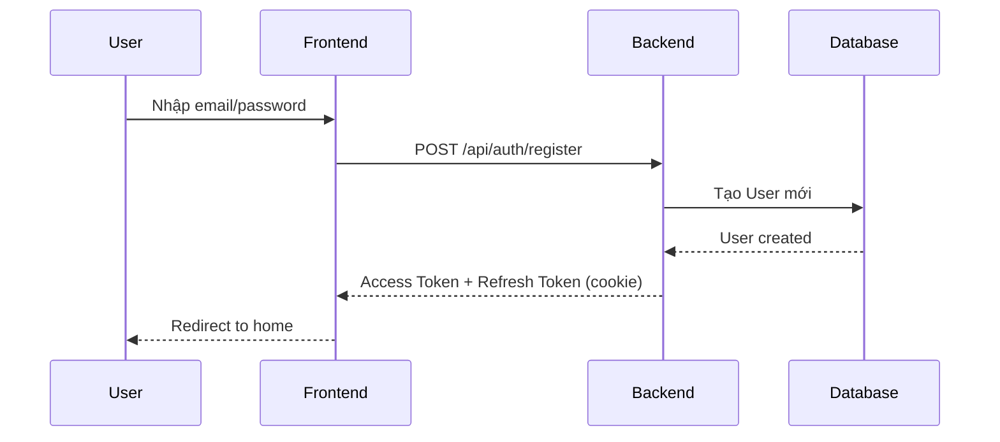
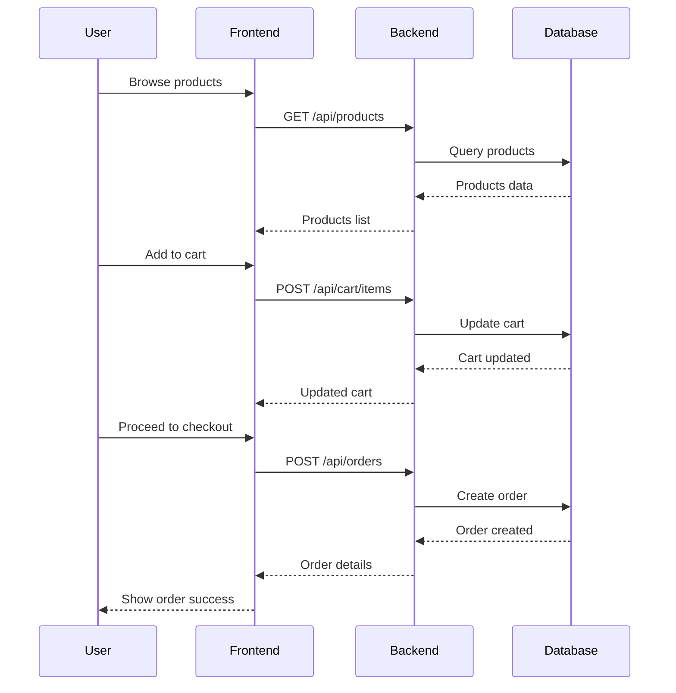
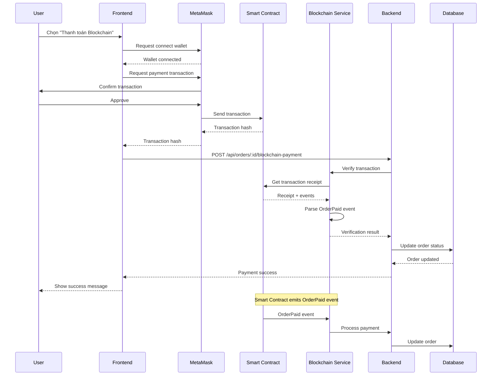
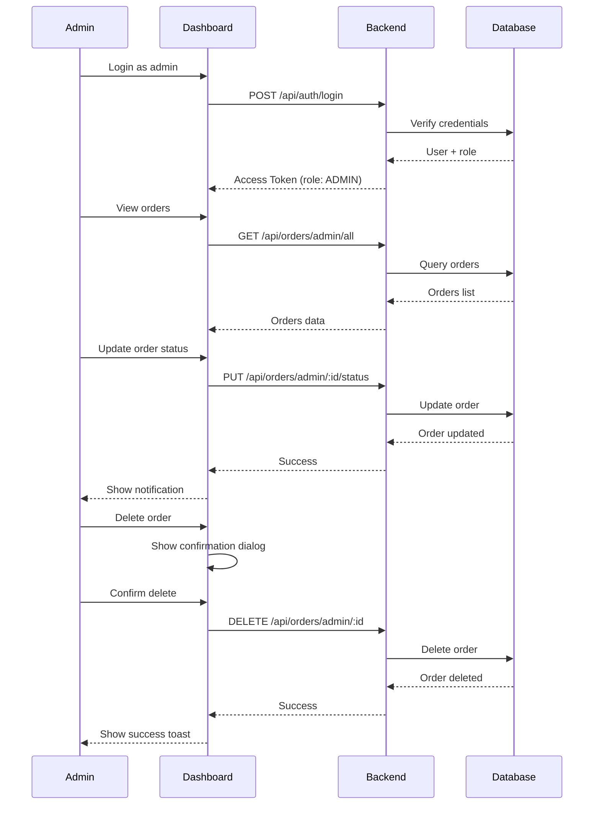
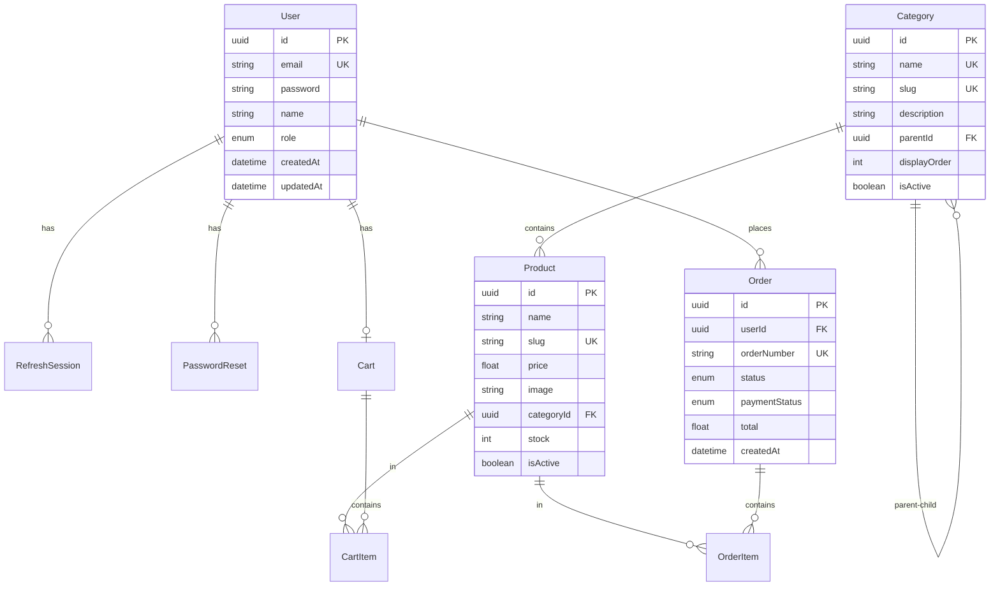

# 📱 E-Commerce Phone Store - Tài Liệu Tổng Quan Dự Án

> **Phiên bản**: 2.0.0 | **Cập nhật**: December 2024  
> **Ngôn ngữ**: Tiếng Việt | **Môi trường**: Development & Production

---

## 📑 Mục Lục

1. [Giới Thiệu Dự Án](#1-giới-thiệu-dự-án)
2. [Kiến Trúc Hệ Thống](#2-kiến-trúc-hệ-thống)
3. [Tech Stack](#3-tech-stack)
4. [Cấu Trúc Thư Mục](#4-cấu-trúc-thư-mục)
5. [Các Tính Năng Chính](#5-các-tính-năng-chính)
6. [Luồng Hoạt Động](#6-luồng-hoạt-động)
7. [API Endpoints](#7-api-endpoints)
8. [Database Schema](#8-database-schema)
9. [Blockchain Integration](#9-blockchain-integration)
10. [Thuật Ngữ và Khái Niệm](#10-thuật-ngữ-và-khái-niệm)
11. [Hướng Dẫn Triển Khai](#11-hướng-dẫn-triển-khai)
12. [Troubleshooting](#12-troubleshooting)

---

## 1. Giới Thiệu Dự Án

### 1.1 Tổng Quan

**E-Commerce Phone Store** là một hệ thống thương mại điện tử hoàn chỉnh chuyên bán các sản phẩm Apple (iPhone, iPad, MacBook, Apple Watch, phụ kiện) với tích hợp thanh toán blockchain.

### 1.2 Mục Tiêu

- ✅ Cung cấp trải nghiệm mua sắm trực tuyến mượt mà cho khách hàng
- ✅ Quản lý sản phẩm, đơn hàng, khách hàng hiệu quả cho admin
- ✅ Hỗ trợ đa phương thức thanh toán (COD, chuyển khoản, blockchain)
- ✅ Tích hợp blockchain payment với MetaMask
- ✅ Responsive design cho mọi thiết bị

### 1.3 Đặc Điểm Nổi Bật

- **Monorepo Architecture**: Quản lý tập trung backend, frontend, blockchain
- **Real-time Updates**: WebSocket cho cập nhật đơn hàng real-time
- **Blockchain Payment**: Thanh toán bằng cryptocurrency (ETH, USDT, USDC)
- **Advanced Admin Dashboard**: Quản lý toàn diện với analytics và charts
- **Hierarchical Categories**: Phân loại sản phẩm linh hoạt nhiều cấp
- **JWT Authentication**: Bảo mật với access token + refresh token

---

## 2. Kiến Trúc Hệ Thống

### 2.1 Sơ Đồ Tổng Quan



### 2.2 Các Thành Phần Chính

#### 2.2.1 Backend API (Express.js)
- **Vai trò**: Xử lý business logic, authentication, database operations
- **Port**: 4000
- **Công nghệ**: Express.js + TypeScript + Prisma ORM
- **Chức năng**:
  - RESTful API endpoints
  - JWT authentication với refresh token
  - Role-based access control (RBAC)
  - File upload (product images)
  - WebSocket cho real-time updates
  - Blockchain event listener

#### 2.2.2 Phone App (Customer Frontend)
- **Vai trò**: Giao diện mua sắm cho khách hàng
- **Port**: 3000
- **Công nghệ**: Next.js 15 + TypeScript + Tailwind CSS
- **Chức năng**:
  - Xem danh sách sản phẩm, chi tiết sản phẩm
  - Giỏ hàng (hỗ trợ cả user đã đăng nhập và anonymous)
  - Đặt hàng với nhiều phương thức thanh toán
  - Thanh toán blockchain qua MetaMask
  - Quản lý tài khoản, lịch sử đơn hàng
  - Responsive design

#### 2.2.3 Admin Dashboard
- **Vai trò**: Quản lý hệ thống cho admin
- **Port**: 3001
- **Công nghệ**: Next.js 14 + shadcn/ui + React Query
- **Chức năng**:
  - Dashboard analytics với charts
  - Quản lý sản phẩm (CRUD)
  - Quản lý danh mục (hierarchical)
  - Quản lý đơn hàng (tracking, update status)
  - Quản lý khách hàng
  - Quản lý người dùng và phân quyền
  - Xóa đơn hàng (mới thêm)

#### 2.2.4 Blockchain Service
- **Vai trò**: Xử lý thanh toán cryptocurrency
- **Công nghệ**: Ethers.js + Hardhat
- **Chức năng**:
  - Lắng nghe events từ smart contract
  - Verify blockchain transactions
  - Cập nhật trạng thái thanh toán
  - Hỗ trợ ETH, USDT, USDC

#### 2.2.5 Database (PostgreSQL)
- **Vai trò**: Lưu trữ dữ liệu
- **ORM**: Prisma
- **Chức năng**:
  - User management
  - Product catalog
  - Order management
  - Cart management
  - Session management

---

## 3. Tech Stack

### 3.1 Backend

| Công Nghệ | Phiên Bản | Mục Đích |
|-----------|-----------|----------|
| Node.js | 20+ | Runtime environment |
| TypeScript | 5.x | Type safety |
| Express.js | 4.x | Web framework |
| Prisma | 6.x | ORM |
| PostgreSQL | 12+ | Database |
| JWT | - | Authentication |
| Zod | - | Validation |
| Bcrypt | - | Password hashing |
| Multer | - | File upload |
| Ethers.js | 5.x | Blockchain integration |
| Helmet | - | Security headers |
| CORS | - | Cross-origin requests |

### 3.2 Frontend (Phone App)

| Công Nghệ | Phiên Bản | Mục Đích |
|-----------|-----------|----------|
| Next.js | 15 | React framework |
| TypeScript | 5.x | Type safety |
| Tailwind CSS | 4.x | Styling |
| Radix UI | - | Headless components |
| shadcn/ui | - | UI components |
| React Hook Form | - | Form management |
| Zod | - | Validation |
| Lucide React | - | Icons |
| next-themes | - | Dark/light mode |

### 3.3 Frontend (Admin Dashboard)

| Công Nghệ | Phiên Bản | Mục Đích |
|-----------|-----------|----------|
| Next.js | 14 | React framework |
| TypeScript | 5.x | Type safety |
| Tailwind CSS | 3.x | Styling |
| shadcn/ui | - | UI components |
| React Query | 5.x | Server state management |
| Zustand | 4.x | Client state management |
| Axios | - | HTTP client |
| Recharts | 2.x | Data visualization |
| Sonner | - | Toast notifications |
| React Hook Form | - | Form management |

### 3.4 Blockchain

| Công Nghệ | Phiên Bản | Mục Đích |
|-----------|-----------|----------|
| Hardhat | - | Development environment |
| Solidity | 0.8.19 | Smart contract language |
| Ethers.js | 5.x | Web3 library |
| OpenZeppelin | - | Smart contract library |
| MetaMask | - | Wallet integration |

---

## 4. Cấu Trúc Thư Mục

### 4.1 Tổng Quan Monorepo

```
newpro/
├── backend/              # Backend API (Express.js)
├── phone-app/            # Customer frontend (Next.js 15)
├── admin-dashboard/      # Admin frontend (Next.js 14)
├── blockchain/           # Smart contracts (Hardhat)
├── README.md             # Tài liệu chính
└── PROJECT_OVERVIEW.md   # Tài liệu này
```

### 4.2 Backend Structure

```
backend/
├── src/
│   ├── app.ts                    # Express app configuration
│   ├── index.ts                  # Server entry point
│   ├── controllers/              # Request handlers
│   │   ├── auth.controller.ts    # Authentication
│   │   ├── product.controller.ts # Product management
│   │   ├── order.controller.ts   # Order management
│   │   ├── cart.controller.ts    # Shopping cart
│   │   └── ...
│   ├── services/                 # Business logic
│   │   ├── auth.service.ts
│   │   ├── order.service.ts
│   │   ├── blockchain/
│   │   │   └── blockchain.service.ts  # Blockchain integration
│   │   └── ...
│   ├── routes/                   # API routes
│   │   ├── auth.route.ts         # /api/auth/*
│   │   ├── product.route.ts      # /api/products/*
│   │   ├── order.route.ts        # /api/orders/*
│   │   ├── blockchain.route.ts   # /api/blockchain/*
│   │   └── ...
│   ├── middlewares/              # Express middlewares
│   │   ├── auth.ts               # JWT authentication
│   │   ├── validate.ts           # Zod validation
│   │   └── error.ts              # Error handling
│   ├── schemas/                  # Zod validation schemas
│   │   ├── auth.schema.ts
│   │   ├── product.schema.ts
│   │   └── ...
│   └── utils/                    # Utilities
│       ├── jwt.ts                # JWT helpers
│       ├── prisma.ts             # Prisma client
│       └── ...
├── prisma/
│   ├── schema.prisma             # Database schema
│   ├── migrations/               # Database migrations
│   └── seed.ts                   # Seed data
├── scripts/
│   ├── create-admin.ts           # Create admin user
│   └── fix-admin-role.ts         # Fix admin role
├── public/pictures/              # Product images
├── uploads/                      # User uploads
├── package.json
├── tsconfig.json
└── docker-compose.yml            # PostgreSQL container
```

**Giải thích**:
- **controllers/**: Xử lý HTTP requests, validate input, gọi services
- **services/**: Business logic, database operations
- **routes/**: Định nghĩa API endpoints và middlewares
- **middlewares/**: Authentication, validation, error handling
- **schemas/**: Zod schemas cho validation
- **prisma/**: Database schema và migrations

### 4.3 Phone App Structure

```
phone-app/
├── src/
│   ├── app/                      # Next.js App Router
│   │   ├── layout.tsx            # Root layout
│   │   ├── page.tsx              # Home page
│   │   ├── (auth)/               # Auth group
│   │   │   ├── login/
│   │   │   └── register/
│   │   ├── account/              # Account pages
│   │   │   ├── profile/
│   │   │   └── orders/
│   │   ├── product/              # Product pages
│   │   │   └── [slug]/
│   │   ├── gio-hang/             # Cart page
│   │   ├── thanh-toan/           # Checkout page
│   │   └── dat-hang-thanh-cong/  # Order success
│   ├── components/               # React components
│   │   ├── auth-provider.tsx     # Auth context
│   │   ├── header/               # Header components
│   │   ├── footer/               # Footer components
│   │   ├── product/              # Product components
│   │   ├── checkout/             # Checkout components
│   │   │   └── blockchain-payment-modal.tsx
│   │   └── ui/                   # shadcn/ui components
│   ├── lib/                      # Utilities
│   │   ├── api.ts                # API client
│   │   ├── auth-client.ts        # Auth utilities
│   │   ├── cart-api.ts           # Cart API
│   │   ├── order-api.ts          # Order API
│   │   ├── blockchain/           # Blockchain integration
│   │   │   ├── config.ts         # Contract config
│   │   │   ├── use-metamask.ts   # MetaMask hook
│   │   │   └── use-payment.ts    # Payment hook
│   │   └── token.ts              # Token management
│   ├── hooks/                    # Custom hooks
│   └── utils/                    # Helper functions
├── public/pictures/              # Static images
├── package.json
├── next.config.ts
└── tailwind.config.ts
```

**Giải thích**:
- **app/**: Next.js 15 App Router với file-based routing
- **components/**: Reusable React components
- **lib/**: API clients, utilities, blockchain integration
- **hooks/**: Custom React hooks
- **blockchain/**: MetaMask và payment integration

### 4.4 Admin Dashboard Structure

```
admin-dashboard/
├── src/
│   ├── app/
│   │   ├── layout.tsx            # Root layout
│   │   ├── providers.tsx         # React Query + Toast
│   │   ├── (auth)/               # Auth routes
│   │   │   └── login/
│   │   └── (dashboard)/          # Protected routes
│   │       ├── layout.tsx        # Dashboard layout
│   │       ├── page.tsx          # Dashboard home
│   │       ├── products/         # Product management
│   │       ├── orders/           # Order management
│   │       ├── customers/        # Customer management
│   │       ├── categories/       # Category management
│   │       └── users/            # User management
│   ├── components/
│   │   ├── layout/               # Sidebar, header
│   │   ├── dashboard/            # Dashboard widgets
│   │   │   ├── revenue-chart.tsx
│   │   │   ├── order-status-chart.tsx
│   │   │   └── ...
│   │   ├── products/             # Product components
│   │   └── ui/                   # shadcn/ui components
│   ├── hooks/                    # React Query hooks
│   │   ├── use-auth.ts
│   │   ├── use-products.ts
│   │   ├── use-orders.ts
│   │   ├── use-dashboard.ts
│   │   └── ...
│   ├── lib/
│   │   ├── api.ts                # Axios instance
│   │   └── auth.ts               # Auth utilities
│   ├── types/                    # TypeScript types
│   │   └── models.ts
│   └── store/                    # Zustand stores (if any)
├── package.json
├── tsconfig.json
└── tailwind.config.ts
```

**Giải thích**:
- **app/(dashboard)/**: Protected admin routes
- **components/dashboard/**: Charts và widgets
- **hooks/**: React Query hooks cho data fetching
- **lib/api.ts**: Axios với JWT interceptor

### 4.5 Blockchain Structure

```
blockchain/
├── contracts/
│   └── PaymentContract.sol       # Smart contract
├── scripts/
│   ├── deploy.ts                 # Deploy script
│   └── test-simple-payment.ts    # Test script
├── config/
│   └── deployed-contracts.json   # Deployed addresses
├── hardhat.config.ts             # Hardhat configuration
├── package.json
└── tsconfig.json
```

**Giải thích**:
- **contracts/**: Solidity smart contracts
- **scripts/**: Deployment và testing scripts
- **config/**: Contract addresses sau khi deploy

---

## 5. Các Tính Năng Chính

### 5.1 Authentication & Authorization

#### 5.1.1 JWT Authentication
- **Access Token**: Thời hạn 15 phút, lưu trong memory/localStorage
- **Refresh Token**: Thời hạn 30 ngày, lưu trong HTTP-only cookie
- **Auto Refresh**: Frontend tự động refresh access token khi hết hạn

#### 5.1.2 Role-Based Access Control (RBAC)
- **USER**: Khách hàng thường
  - Xem sản phẩm
  - Quản lý giỏ hàng
  - Đặt hàng
  - Xem lịch sử đơn hàng
- **ADMIN**: Quản trị viên
  - Tất cả quyền của USER
  - Quản lý sản phẩm (CRUD)
  - Quản lý đơn hàng (update status, xóa)
  - Quản lý khách hàng
  - Xem analytics và reports

#### 5.1.3 Password Reset
- Request reset qua email
- Token có thời hạn
- One-time use token

### 5.2 Product Management

#### 5.2.1 Hierarchical Categories
- **Cấu trúc**: Parent → Child → Grandchild
- **Ví dụ**: "Điện thoại" → "iPhone" → "iPhone 15 Series"
- **Tính năng**:
  - Tạo/sửa/xóa category
  - Drag & drop để sắp xếp
  - Active/Inactive status

#### 5.2.2 Product Features
- **Thông tin cơ bản**: Name, slug, description, price
- **Hình ảnh**: Main image + gallery (multiple images)
- **Variants**: Color, storage options
- **Specs**: RAM, storage, flexible JSON specs
- **Badges**: "Trả góp 0%", "Giảm sốc", etc.
- **Stock management**: Inventory tracking
- **Ratings & Reviews**: Rating score và review count

### 5.3 Shopping Cart

#### 5.3.1 Cart Types
- **Logged-in User**: Cart lưu trong database, đồng bộ across devices
- **Anonymous User**: Cart lưu trong sessionStorage, chuyển sang database khi login

#### 5.3.2 Cart Operations
- Add to cart
- Update quantity
- Remove item
- Clear cart
- Apply variants (color, storage)

### 5.4 Order Management

#### 5.4.1 Order Creation
- **Customer Info**: Name, email, phone
- **Shipping Address**: Address, city, district, ward
- **Payment Method**: COD, Bank Transfer, MoMo, VNPay, Blockchain
- **Order Items**: Products với variants

#### 5.4.2 Order Status Flow
```
PENDING → CONFIRMED → PROCESSING → SHIPPING → DELIVERED
                ↓
            CANCELLED
```

#### 5.4.3 Payment Status
- **PENDING**: Chưa thanh toán
- **COMPLETED**: Đã thanh toán
- **FAILED**: Thanh toán thất bại
- **REFUNDED**: Đã hoàn tiền

#### 5.4.4 Admin Operations
- Update order status
- Update payment status
- View order details
- Delete order (mới thêm)
- Export orders to Excel

### 5.5 Blockchain Payment

#### 5.5.1 Supported Tokens
- **ETH**: Native Ethereum/BNB
- **USDT**: Tether stablecoin
- **USDC**: USD Coin stablecoin

#### 5.5.2 Payment Flow
1. Customer chọn "Thanh toán Blockchain"
2. Nhập số lượng crypto
3. Kết nối MetaMask wallet
4. Approve token (nếu dùng ERC20)
5. Gửi transaction
6. Backend lắng nghe event từ smart contract
7. Verify transaction
8. Cập nhật order status

#### 5.5.3 Smart Contract Features
- **PaymentContract.sol**: Main payment contract
- **Events**: OrderPaid event khi thanh toán thành công
- **Security**: ReentrancyGuard, Ownable
- **Functions**:
  - `payOrderWithNative()`: Thanh toán bằng ETH/BNB
  - `payOrderWithToken()`: Thanh toán bằng ERC20
  - `isOrderProcessed()`: Kiểm tra order đã xử lý chưa

### 5.6 Admin Dashboard Analytics

#### 5.6.1 Dashboard Widgets
- **Revenue Chart**: Line chart hiển thị doanh thu theo thời gian
- **Order Status Chart**: Pie chart phân bố trạng thái đơn hàng
- **Top Products**: Best-selling products
- **Recent Orders**: Đơn hàng mới nhất

#### 5.6.2 Reports
- Revenue by period (7 days, 30 days, 12 months)
- Order statistics
- Customer analytics
- Product performance

---

## 6. Luồng Hoạt Động

### 6.1 User Registration & Login Flow



### 6.2 Shopping & Checkout Flow



### 6.3 Blockchain Payment Flow



### 6.4 Admin Order Management Flow



---

## 7. API Endpoints

### 7.1 Authentication APIs

| Method | Endpoint | Auth | Description |
|--------|----------|------|-------------|
| POST | `/api/auth/register` | ❌ | Đăng ký tài khoản mới |
| POST | `/api/auth/login` | ❌ | Đăng nhập |
| POST | `/api/auth/logout` | ✅ | Đăng xuất |
| POST | `/api/auth/refresh` | 🔄 | Refresh access token |
| GET | `/api/auth/me` | ✅ | Lấy thông tin user hiện tại |

**Legend**: ✅ = Requires auth, ❌ = Public,[object Object] token required

### 7.2 Product APIs

| Method | Endpoint | Auth | Role | Description |
|--------|----------|------|------|-------------|
| GET | `/api/products` | ❌ | - | Danh sách sản phẩm (có filter, pagination) |
| GET | `/api/products/:id` | ❌ | - | Chi tiết sản phẩm |
| GET | `/api/products/slug/:slug` | ❌ | - | Lấy sản phẩm theo slug |
| POST | `/api/products` | ✅ | ADMIN | Tạo sản phẩm mới |
| PUT | `/api/products/:id` | ✅ | ADMIN | Cập nhật sản phẩm |
| DELETE | `/api/products/:id` | ✅ | ADMIN | Xóa sản phẩm |

**Query Parameters cho GET /api/products**:
- `categorySlug`: Filter theo category
- `search`: Tìm kiếm theo tên
- `minPrice`, `maxPrice`: Filter theo giá
- `sortBy`: Sắp xếp (price, createdAt, name)
- `order`: asc hoặc desc
- `page`, `limit`: Pagination

### 7.3 Category APIs

| Method | Endpoint | Auth | Role | Description |
|--------|----------|------|------|-------------|
| GET | `/api/categories` | ❌ | - | Danh sách categories (hierarchical) |
| GET | `/api/categories/:id` | ❌ | - | Chi tiết category |
| POST | `/api/categories` | ✅ | ADMIN | Tạo category mới |
| PUT | `/api/categories/:id` | ✅ | ADMIN | Cập nhật category |
| DELETE | `/api/categories/:id` | ✅ | ADMIN | Xóa category |

### 7.4 Cart APIs

| Method | Endpoint | Auth | Description |
|--------|----------|------|-------------|
| GET | `/api/cart` | ✅ | Lấy giỏ hàng của user |
| POST | `/api/cart/items` | ✅ | Thêm sản phẩm vào giỏ |
| PUT | `/api/cart/items/:id` | ✅ | Cập nhật số lượng |
| DELETE | `/api/cart/items/:id` | ✅ | Xóa sản phẩm khỏi giỏ |
| DELETE | `/api/cart` | ✅ | Xóa toàn bộ giỏ hàng |

### 7.5 Order APIs

| Method | Endpoint | Auth | Role | Description |
|--------|----------|------|------|-------------|
| POST | `/api/orders` | ✅ | USER | Tạo đơn hàng mới |
| GET | `/api/orders` | ✅ | USER | Danh sách đơn hàng của user |
| GET | `/api/orders/:id` | ✅ | USER | Chi tiết đơn hàng |
| GET | `/api/orders/number/:orderNumber` | ✅ | USER | Lấy đơn hàng theo số |
| POST | `/api/orders/:id/cancel` | ✅ | USER | Hủy đơn hàng |
| POST | `/api/orders/:id/blockchain-payment` | ❌ | - | Xác nhận thanh toán blockchain |
| GET | `/api/orders/admin/all` | ✅ | ADMIN | Tất cả đơn hàng (admin) |
| PUT | `/api/orders/admin/:id/status` | ✅ | ADMIN | Cập nhật trạng thái đơn |
| PUT | `/api/orders/admin/:id/payment` | ✅ | ADMIN | Cập nhật trạng thái thanh toán |
| DELETE | `/api/orders/admin/:id` | ✅ | ADMIN | Xóa đơn hàng |

### 7.6 Dashboard APIs (Admin Only)

| Method | Endpoint | Auth | Description |
|--------|----------|------|-------------|
| GET | `/api/dashboard/stats` | ✅ ADMIN | Thống kê tổng quan |
| GET | `/api/dashboard/revenue` | ✅ ADMIN | Doanh thu theo thời gian |
| GET | `/api/dashboard/products/top` | ✅ ADMIN | Top sản phẩm bán chạy |
| GET | `/api/dashboard/orders/recent` | ✅ ADMIN | Đơn hàng gần đây |

### 7.7 Upload APIs

| Method | Endpoint | Auth | Role | Description |
|--------|----------|------|------|-------------|
| POST | `/api/upload` | ✅ | ADMIN | Upload hình ảnh sản phẩm |

**Request**: `multipart/form-data` với field `image`
**Response**: `{ url: string }` - URL của hình ảnh đã upload

### 7.8 Static File Serving

| Path | Description |
|------|-------------|
| `/pictures/*` | Product images từ `backend/public/pictures/` |
| `/uploads/*` | User uploaded files từ `backend/uploads/` |

---

## 8. Database Schema

### 8.1 Entity Relationship Diagram



### 8.2 Core Models

#### 8.2.1 User Model

```prisma
model User {
  id        String   @id @default(uuid())
  email     String   @unique
  password  String   // bcrypt hashed
  name      String
  role      Role     @default(USER)  // USER | ADMIN
  createdAt DateTime @default(now())
  updatedAt DateTime @updatedAt

  sessions       RefreshSession[]
  passwordResets PasswordReset[]
  cart           Cart?
  orders         Order[]
}

enum Role {
  USER
  ADMIN
}
```

**Giải thích**:
- `id`: UUID primary key
- `email`: Unique, dùng để login
- `password`: Bcrypt hashed, không bao giờ trả về client
- `role`: USER (khách hàng) hoặc ADMIN (quản trị viên)

#### 8.2.2 RefreshSession Model

```prisma
model RefreshSession {
  id         String    @id @default(uuid())  // JWT ID (jti)
  userId     String
  user       User      @relation(fields: [userId], references: [id])
  createdAt  DateTime  @default(now())
  expiresAt  DateTime
  revokedAt  DateTime? // null = active, non-null = revoked

  @@index([userId])
  @@index([expiresAt])
}
```

**Giải thích**:
- Lưu refresh token sessions
- `revokedAt`: null = session còn hiệu lực, có giá trị = đã revoke
- Auto cleanup expired sessions

#### 8.2.3 Category Model (Hierarchical)

```prisma
model Category {
  id          String     @id @default(uuid())
  name        String     @unique
  slug        String     @unique
  description String?
  image       String?
  icon        String?
  parentId    String?    // Self-reference
  parent      Category?  @relation("CategoryHierarchy", fields: [parentId], references: [id])
  children    Category[] @relation("CategoryHierarchy")
  products    Product[]
  displayOrder Int       @default(0)
  isActive    Boolean    @default(true)
  createdAt   DateTime   @default(now())
  updatedAt   DateTime   @updatedAt

  @@index([slug])
  @@index([parentId])
  @@index([isActive])
}
```

**Giải thích**:
- **Hierarchical structure**: Self-referencing với `parentId`
- **Ví dụ hierarchy**:
  ```
  Điện thoại (parentId: null)
    ├── iPhone (parentId: Điện thoại.id)
    │   ├── iPhone 15 Series (parentId: iPhone.id)
    │   └── iPhone 14 Series
    └── Samsung
        └── Galaxy S Series
  ```
- `displayOrder`: Thứ tự hiển thị
- `isActive`: Ẩn/hiện category

#### 8.2.4 Product Model

```prisma
model Product {
  id          String   @id @default(uuid())
  name        String
  slug        String   @unique
  description String?
  price       Float
  listPrice   Float?   // Giá gốc (để hiển thị giảm giá)
  image       String   // Main image
  images      String[] @default([])  // Gallery images
  categoryId  String
  category    Category @relation(fields: [categoryId], references: [id])
  brand       String
  stock       Int      @default(0)
  rating      Float?   @default(0)
  reviews     Int      @default(0)
  badges      String[] @default([])  // ["Trả góp 0%", "Giảm sốc"]
  installment Boolean  @default(false)
  isActive    Boolean  @default(true)

  // Specs
  ram         Int?     // GB
  storage     Int?     // GB
  specs       Json?    // Flexible specs object

  cartItems   CartItem[]
  orderItems  OrderItem[]

  createdAt   DateTime @default(now())
  updatedAt   DateTime @updatedAt

  @@index([slug])
  @@index([categoryId])
  @@index([isActive])
  @@index([price])
}
```

**Giải thích**:
- `listPrice`: Giá gốc để hiển thị % giảm giá
- `images`: Array các URL hình ảnh phụ
- `badges`: Array các nhãn như "Trả góp 0%"
- `specs`: JSON object linh hoạt cho các thông số kỹ thuật

#### 8.2.5 Cart & CartItem Models

```prisma
model Cart {
  id        String     @id @default(uuid())
  userId    String?    @unique  // For logged-in users
  sessionId String?    @unique  // For anonymous users
  items     CartItem[]
  createdAt DateTime   @default(now())
  updatedAt DateTime   @updatedAt

  @@index([userId])
  @@index([sessionId])
}

model CartItem {
  id              String  @id @default(uuid())
  cartId          String
  cart            Cart    @relation(fields: [cartId], references: [id], onDelete: Cascade)
  productId       String
  product         Product @relation(fields: [productId], references: [id])
  quantity        Int     @default(1)
  selectedColor   String?
  selectedStorage String?
  createdAt       DateTime @default(now())
  updatedAt       DateTime @updatedAt

  @@index([cartId])
  @@index([productId])
}
```

**Giải thích**:
- Cart hỗ trợ cả logged-in user (`userId`) và anonymous user (`sessionId`)
- `selectedColor`, `selectedStorage`: Variants được chọn

#### 8.2.6 Order & OrderItem Models

```prisma
model Order {
  id            String        @id @default(uuid())
  userId        String
  user          User          @relation(fields: [userId], references: [id])
  orderNumber   String        @unique  // ORD-XXXXX-YYYYY
  status        OrderStatus   @default(PENDING)

  // Customer info
  customerName  String
  customerEmail String
  customerPhone String

  // Shipping info
  shippingAddress  String
  shippingCity     String
  shippingDistrict String?
  shippingWard     String?

  // Payment
  paymentMethod    PaymentMethod
  paymentStatus    PaymentStatus  @default(PENDING)

  // Crypto payment (optional)
  cryptoWallet     String?
  cryptoNetwork    String?
  cryptoToken      String?
  cryptoTxHash     String?
  cryptoAmount     Float?
  cryptoVerifiedAt DateTime?
  cryptoConfirmations Int?

  // Pricing
  subtotal      Float
  shippingFee   Float  @default(0)
  discount      Float  @default(0)
  total         Float

  notes         String?
  items         OrderItem[]

  createdAt     DateTime @default(now())
  updatedAt     DateTime @updatedAt

  @@index([userId])
  @@index([orderNumber])
  @@index([status])
  @@index([paymentStatus])
}

enum OrderStatus {
  PENDING      // Chờ xác nhận
  CONFIRMED    // Đã xác nhận
  PROCESSING   // Đang xử lý
  SHIPPING     // Đang giao
  DELIVERED    // Đã giao
  CANCELLED    // Đã hủy
}

enum PaymentStatus {
  PENDING      // Chưa thanh toán
  COMPLETED    // Đã thanh toán
  FAILED       // Thất bại
  REFUNDED     // Đã hoàn tiền
}

enum PaymentMethod {
  COD
  CARD
  MOMO
  VNPAY
  BANK_TRANSFER
  INSTALLMENT
  CRYPTO
}

model OrderItem {
  id              String  @id @default(uuid())
  orderId         String
  order           Order   @relation(fields: [orderId], references: [id], onDelete: Cascade)
  productId       String
  productName     String  // Snapshot tại thời điểm đặt hàng
  productImage    String
  price           Float   // Giá tại thời điểm đặt hàng
  quantity        Int
  selectedColor   String?
  selectedStorage String?
  subtotal        Float   // price * quantity

  @@index([orderId])
  @@index([productId])
}
```

**Giải thích**:
- `orderNumber`: Mã đơn hàng unique, format: `ORD-XXXXX-YYYYY`
- **Crypto fields**: Lưu thông tin thanh toán blockchain
  - `cryptoTxHash`: Transaction hash trên blockchain
  - `cryptoVerifiedAt`: Thời điểm verify transaction
  - `cryptoConfirmations`: Số confirmations
- **OrderItem**: Snapshot sản phẩm tại thời điểm đặt hàng (name, image, price)

### 8.3 Database Indexes

**Indexes quan trọng**:
- `User.email`: Unique index cho login
- `Category.slug`: Unique index cho URL-friendly routing
- `Product.slug`: Unique index cho product pages
- `Order.orderNumber`: Unique index cho tracking
- `RefreshSession.expiresAt`: Index cho cleanup expired sessions

---